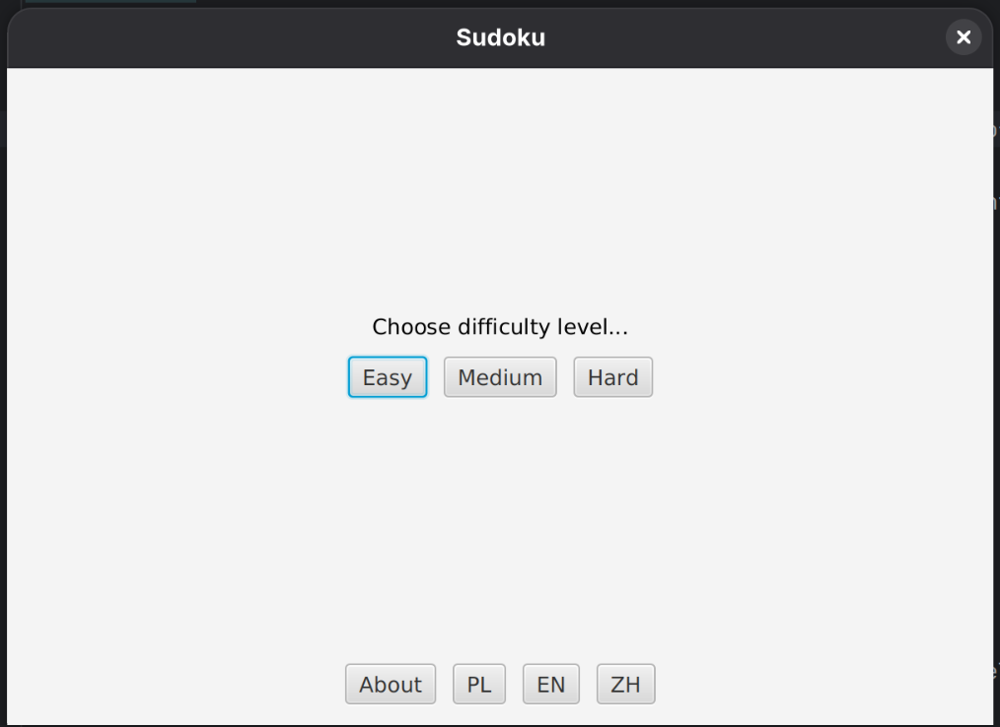
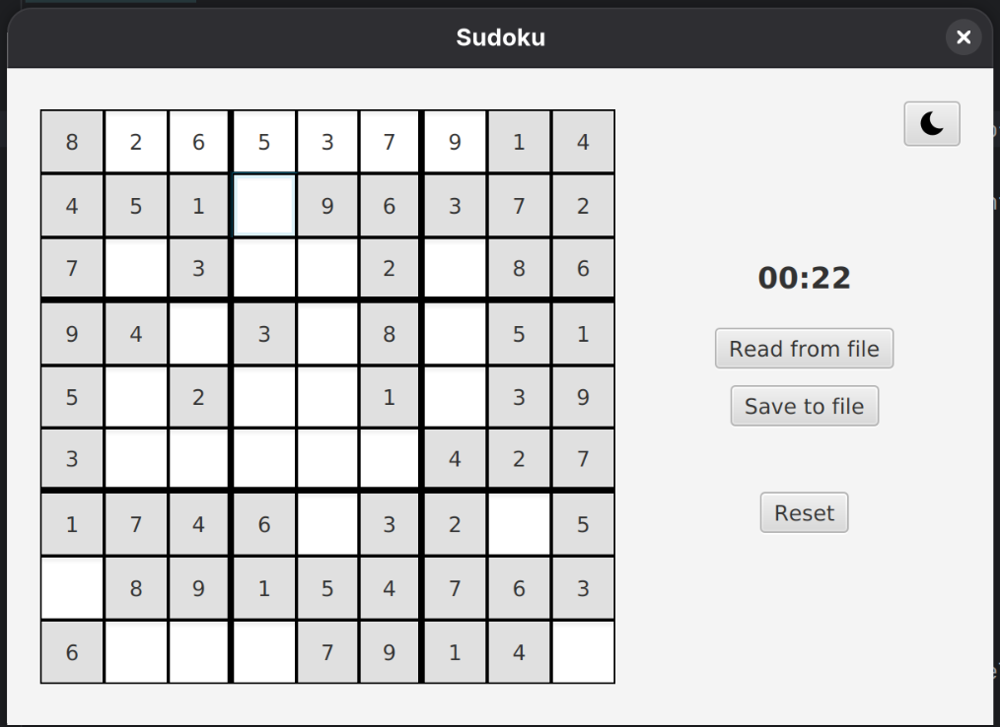
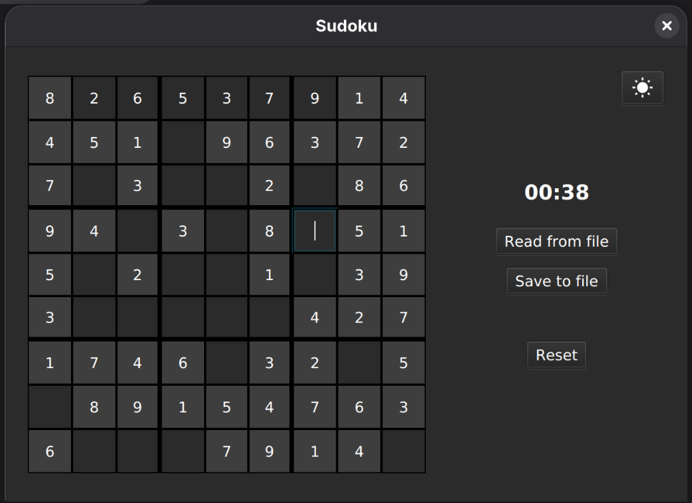

# Sudoku

A simple yet robust desktop Sudoku application developed as a project for a Component Programming university course. This application demonstrates the practical application of software engineering principles, design patterns, and modern Java technologies.

## Features

*   **Interactive Gameplay**: Classic Sudoku experience with an intuitive user interface.
*   **Difficulty Levels**: Multiple difficulty settings to challenge players of all skill levels.
*   **Internationalization (i18n)**: Full language support for English, Polish, and Traditional Chinese.
*   **Themes**: Switch between Light and Dark themes for comfortable viewing in any environment.
*   **Persistence**: Save and load game states using either local files or a PostgreSQL database.

## Technologies Used

*   **JUnit 5**: For comprehensive unit testing.
*   **JavaFX 21**: For building a responsive user interface.
*   **Apache Maven**: For dependency management and build automation.
*   **PostgreSQL**: For data persistence.
*   **Docker**: For consistent database deployment.
*   **Checkstyle**: For ensuring code quality and adherence to strict coding standards.
*   **SLF4J + Logback**: For configurable logging across application layers.

## Database Integration & ACID compliance

*   **ACID Rules:** The database operations strictly follow ACID rules to guarantee stability.
    * **Atomicity:** The `JdbcSudokuBoardDao` begins a database transaction explicitly (`connection.setAutoCommit(false)`), allowing operations (like inserting the board and 81 separate fields) to succeed entirely or fail entirely (via `connection.rollback()`).
    * **Consistency:** Constraints and foreign keys check bounds (e.g. `index BETWEEN 0 AND 80`), protecting database states from becoming corrupt.
    * **Isolation:** The connections use `TRANSACTION_SERIALIZABLE` isolation level. This strict level ensures absolute synchronization with optimistic locking handling concurrency safely without conflicts.
    * **Durability:** PostgreSQL handles saving executed commits directly onto persistent docker volumes.
*   **Object-Relational Mapping (ORM) & Inheritance:** The object model of Java classes is mapped cleanly onto tables. We map properties of our `SudokuBoard` into rows in the `boards` and `board_fields` tables. Additionally, we use an implicit mapping of object structure by not strictly inheriting database schemas. Java abstract structures like `SudokuFieldContainer` (for Rows, Columns, Boxes) are constructed logically using offsets in RAM instead of complicating SQL hierarchies with `Table-Per-Class` approaches. This decision greatly speeds up performance while adhering to clean SOLID architecture.
*   **Optimistic Locking:** We introduced a specific `version` column inside our board tables. Updates check for modifications using this field. Concurrent overwrites thus throw an application level exception immediately instead of silently destroying user data.

## Architecture & Design Patterns

This project utilizes a **Maven Multi-Module** structure to enforce a strict separation of concerns, ensuring loose coupling between the user interface and business logic.

* **Model-View-Controller (MVC):** The core architectural pattern used to decouple the backend logic from the JavaFX frontend.
* **DAO (Data Access Object):** Abstracts the persistence layer, allowing the application to switch seamlessly between File System storage and PostgreSQL without changing business logic.
* **Singleton:** Implemented for the `SceneManager` to ensure a consistent state across all windows.
* **Factory Pattern:** Used to generate Sudoku boards of varying difficulty levels.
* **Observer Pattern:** Used to automatically revert invalid field states.

## Screenshots

<p align="center">
  
  
  
</p>

## Getting Started

Follow these instructions to get a copy of the project up and running on your local machine.

### Prerequisites

*   Java Development Kit (JDK) 21
*   Apache Maven
*   Docker & Docker Compose

### Installation & Running

1.  **Clone the repository**
    ```bash
    git clone https://github.com/chlebicz/sudoku.git
    cd sudoku
    ```
    
2. **(Optional) Configure the database connection**
   The project requires database credentials to use the database instead of default file storage:
    * Rename `.env.example` to `.env`.
    * Update the variables if you wish to change the default Docker credentials.

3.  **(Optional) Start the database**
    This project uses PostgreSQL running in a Docker container. Start the database service using Docker Compose:
    ```bash
    docker-compose up -d
    ```

4.  **Build the Project**
    Compile the source code and install dependencies:
    ```bash
    mvn clean package
    ```
    This creates a "fat JAR" containing all necessary dependencies.

5.  **Run the Application**
    Launch the application using the created JAR file:
    ```bash
    java -jar View/target/View-1.0-SNAPSHOT.jar
    ```

## Quality Assurance

To verify code quality and run the test suite:

```bash
# Run Unit Tests
mvn test

# Check Code Style compliance
mvn checkstyle:check
```

## License

Distributed under the [MIT License](LICENSE).

## Authors

*   **Mikołaj Chlebicz**
*   **Bartosz Horna**